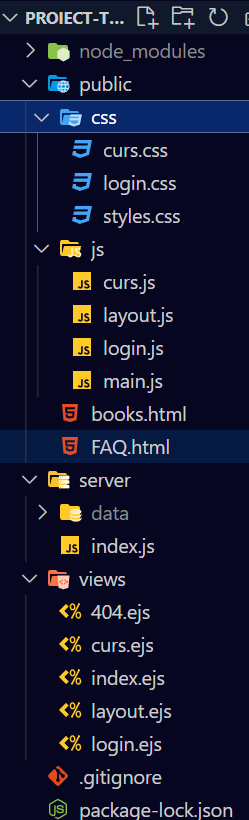

# Prezentare

## HTML & CSS

1. fișiere separate pentru HTML și CSS
   

-------------
<br>

2. folosiți elemente semantice  [Link](./views/layout.ejs#L19)

``` HTML
<body>
    <div class="wrapper">

        <footer class="foot">
          <p class="current-time">
            Time is currently: <span></span>
          </p>
          <p class="last-time">
            Last visit on: <span></span>
          </p>
        </footer>


        <div class="dropbar">
        <nav>
            <ul class="primary">
              {...}
            </ul>
          </nav>
        </div>

        <aside class="sidebar">
            <a class="active" href="#home">Filters</a>
        </aside>
            
        <section class="content">
            <%- body -%>
        </section>

    </div>
    
</body>
```
2. site-ul trebuie să fie responsive (folosiți media queries și unități relative)
``` CSS
@media screen and (max-width: 700px) {
    .sidebar a {float: left;}
    .wrapper {
      grid-template-areas: "dropbar"
                           "content"
                           "foot";
      grid-template-columns: 1fr;
      grid-template-rows: auto auto auto;
    }
    .sidebar {
      display: none;
    };
  }
```
3. folosiți majoritatea selectorilor CSS (cei de bază, pseudo-clase și peseudo-elemente, combinatori)

4. folosiți majoritatea proprietăților CSS prezentate în laboratorul 2

```CSS
.container .box span
  {
    display: block;
    position: absolute;
    top: 0;
    left: 0;
    right: 0;
    bottom: 0;
    z-index: 5;
    pointer-events: none;
  }
```
```CSS
.container .box span::before
  {
    content:'';
    position: absolute;
    top: 0;
    left: 0;
    width: 0;
    height: 0;
    border-radius: 8px;
    background: rgba(255, 255, 255, 0.1);
    backdrop-filter: blur(10px);
    opacity: 0;
    transition: 0.1s;  
    animation: animate 2s ease-in-out infinite; 
    box-shadow: 0 5px 15px rgba(0,0,0,0.08)
  } 
```
```CSS
  #myMenu {
    list-style-type: none;
    padding: 0;
    margin: 0;
  }
```
5. folosiți flex și grid layouts
```CSS
.wrapper {
  display: grid;
  width: 100%;
  grid-template-areas: "dropbar dropbar"
                        "sidebar content"
                        "sidebar foot";
  grid-template-rows: min-content;
  min-height: 100vh;
  grid-template-columns: auto 6fr;
}
```
6. existența unui meniu drop-down folosind CSS

7. tranziții CSS pentru diferite proprietăți
```CSS
.container .box::before
  {
    content:' ';
    position: absolute;
    top: 0;
    left: 50px;
    width: 50%;
    height: 100%;
    text-decoration: none;
    background: #fff;
    border-radius: 8px;
    transform: skewX(5deg);
    transition: 0.5s;
  }
```
8. animații CSS care să modifice mai multe proprietăți
```CSS
.container .box span::before
  {
    content:'';
    position: absolute;
    top: 0;
    left: 0;
    width: 0;
    height: 0;
    border-radius: 8px;
    background: rgba(255, 255, 255, 0.1);
    backdrop-filter: blur(10px);
    opacity: 0;
    transition: 0.1s;  
    animation: animate 2s ease-in-out infinite; 
    box-shadow: 0 5px 15px rgba(0,0,0,0.08)
  }
```
```CSS
 @keyframes animate
  {
    0%, 100%
    {
      transform: translateY(10px);
    }
    
    50%
    {
      transform: translate(-10px);
    }
  }
```

## Javascript

1. fișiere separate de JavaScript

2. modificarea stilului unui element sau unui grup de elemente


// agauga clasa box la carduri si pune background
```js
function addStylesToCards() {
    console.log("hey")
    const choices = [
        ['#96d0eb', '#e89ab6'],
        ['#9dd984', '#7dc4c9'],
        ['#c0af81', '#ff0058'],
        ['#5fb89f','#83d173'],
        ['#03adfc','#6853ad'],
        ['#e8c258', '#e37d24'],
        ['#ab23b8', '#5b14b3']
    ]
    const carduri = document.querySelectorAll(".container .box")
    carduri.forEach((el, idx) => {
        console.log("stilizat un element")
        const [color1, color2] = choices[Math.floor(Math.random() * choices.length)]
        el.style.setProperty('--back-value', `linear-gradient(315deg, ${color1}, ${color2})`)
    })
}
```

3. manipularea DOM-ului (selectați elemente după ID, clasă, tag și querySelector)
```js
//functie care filtreaza prin search cursurile
function myFunction() {
    const input = document.getElementById("mySearch");
    const filter = input.value.toUpperCase();
    const cards = document.querySelectorAll(".carduri .container .box")
    cards.forEach(el => {
        const found_in_text = (text) => {
            return text.toUpperCase().includes(filter)
        }
```
```js
function dynamicBackground()
{
    const sidebarEl = document.querySelector(".sidebar a.active")
    const color = window.getComputedStyle(sidebarEl).color
    const bcolor = window.getComputedStyle(sidebarEl).background
    const firstCardContent = document.querySelector(".carduri .box .box-content")
    const firstCardBtn = firstCardContent.getElementsByTagName("a")[0]
    firstCardBtn.style.color = color
    firstCardBtn.style.background = bcolor

```
```js
// cand apasam pe un link din sidebar, filtram cursurile dupa tag
function onSidebarClick(e)
{
    const tag = e.target.text

    document.querySelector("#mySearch ").value = `#${tag}`

    const myContainer = document.querySelector(".carduri .container");
    const cards = Array.from(myContainer.getElementsByClassName("box"))
    cards.forEach(el => {
        const tagsText = el.querySelector("div.box-content")
            .getAttribute("mytags")
            .toLowerCase()
        
        if (tagsText.includes(tag.toLowerCase())) 
            el.style.display = "flex"
        else
            el.style.display = "none"
    })
}
```

4. crearea și ștergerea de elemente

```js
async function loadAndAddCards()
{
    const elementForCards = document.querySelector('.content > .carduri > .container')

    function elimina_loading_card()
    {
        elementForCards.innerHTML = ''
    }

    function populate_cursuri(cursuri)
    {
        cursuri.forEach(curs => {
            const innerHtmlText = `
                <span></span>
                <div mytags="${curs.tags.join(' ')}" class="box-content">
                    <h2>${curs.titlu}</h2>
                    <p>
                        ${curs.descriere}</p>
                    <a href="#">Read More</a>
                </div>
            `
            
            const el = document.createElement('div')
            el.classList.add('box')
            el.innerHTML = innerHtmlText
            elementForCards.appendChild(el)
        })
    }
```

5. inputuri și formulare
In fisierul [Login.js](./public/js/login.js) avem logica pentru inputuri si formulare pentru login/register
```JS
// deoarece folosim un fetch request pentru a ne loga
    formRegister.addEventListener('submit', (e) => {
        e.preventDefault()

        if (!checkRegex(registerUser))
            return 

        console.log(`Creating user: ${registerUser} | ${registerPass}`)
        fetch('/user/create', {
            method: "POST",
            headers:{
                'Content-Type': 'application/json'
            },
            body: JSON.stringify({
                user: registerUser,
                password: registerPass
            })
        })
        .then(r => r.json())
        .then(resp => {
            if (resp.status != 'OK')
                alert(`Username ${registerUser} taken!`)
            else {
                // window.location.href = '/'
                alert(`Account created, you can now login`)
            }
        })
    })
```

6. folosiți setTimeout() și setInterval()
```js
// dupa fetch asteptam 200ms sa dam impresia de incarcare
function sleep(ms){
    return new Promise( resolver => setTimeout(resolver, ms));
};
```

```js
function footerSetup()
{
    const elTime = document.querySelector(".wrapper .foot p.current-time > span")
    console.log(elTime)
    const ElLastTime = document.querySelector(".wrapper .foot p.last-time > span")
    console.log(ElLastTime)

    const updateTime = () => 
    {
        const date = new Date;
        const timeString = date.toLocaleString('en-US')
        elTime.textContent = timeString
    }

    const displayLastTime = () =>
    {
        let date = localStorage.getItem("last-time")
        if (!date) 
            date = "-"

        ElLastTime.textContent = date

        localStorage.setItem("last-time", (new Date).toString())
    }
    
    displayLastTime()
    updateTime()

    setInterval(updateTime, 1000)
}
```

7. folosirea LocalStorage

```js
function footerSetup()
{
    const elTime = document.querySelector(".wrapper .foot p.current-time > span")
    console.log(elTime)
    const ElLastTime = document.querySelector(".wrapper .foot p.last-time > span")
    console.log(ElLastTime)

    const updateTime = () => 
    {
        const date = new Date;
        const timeString = date.toLocaleString('en-US')
        elTime.textContent = timeString
    }

    const displayLastTime = () =>
    {
        let date = localStorage.getItem("last-time")
        if (!date) 
            date = "-"

        ElLastTime.textContent = date

        localStorage.setItem("last-time", (new Date).toString())
    }
    
    displayLastTime()
    updateTime()

    setInterval(updateTime, 1000)
}
```

8. folosirea a cel puțin o metodă din clasele Math, Array, String, Date

```js
app.post('/user/create', (req, res) => {
    const {user, password} = req.body
    const Users = getAccounts()
    console.log("Users")
    console.log(Users)
    for (let idx in Array.from(Users)) {
        const acc = Users[idx]
        console.log(acc)
        if (acc['user'] == user)
            return res.send(badRequest({msg: "Username taken"}))
    }
    Users.push({user: user, password: password})
    saveAccounts(Users)
    return res.send(validRequest({msg: "Account created"}))
})
```

```js
function addStylesToCards() {
    console.log("hey")
    const choices = [
        ['#96d0eb', '#e89ab6'],
        ['#9dd984', '#7dc4c9'],
        ['#c0af81', '#ff0058'],
        ['#5fb89f','#83d173'],
        ['#03adfc','#6853ad'],
        ['#e8c258', '#e37d24'],
        ['#ab23b8', '#5b14b3']
    ]
    const carduri = document.querySelectorAll(".container .box")
    carduri.forEach((el, idx) => {
        console.log("stilizat un element")
        const [color1, color2] = choices[Math.floor(Math.random() * choices.length)]
        el.style.setProperty('--back-value', `linear-gradient(315deg, ${color1}, ${color2})`)
    })
}
```
```js
function loadTags(cursuri)
{
    const toPascalCase = (sentence) => sentence
        .split(' ')
        .map(word => word[0]
            .toUpperCase()
            .concat(word.toLowerCase().slice(1)))
        .join(' ');
```
```js
    const displayLastTime = () =>
    {
        let date = localStorage.getItem("last-time")
        if (!date) 
            date = "-"

        ElLastTime.textContent = date

        localStorage.setItem("last-time", (new Date).toString())
    }
```

9. schimbarea aleatorie a unor proprietăți
```js
function addStylesToCards() {
    console.log("hey")
    const choices = [
        ['#96d0eb', '#e89ab6'],
        ['#9dd984', '#7dc4c9'],
        ['#c0af81', '#ff0058'],
        ['#5fb89f','#83d173'],
        ['#03adfc','#6853ad'],
        ['#e8c258', '#e37d24'],
        ['#ab23b8', '#5b14b3']
    ]
    const carduri = document.querySelectorAll(".container .box")
    carduri.forEach((el, idx) => {
        console.log("stilizat un element")
        const [color1, color2] = choices[Math.floor(Math.random() * choices.length)]
        el.style.setProperty('--back-value', `linear-gradient(315deg, ${color1}, ${color2})`)
    })
}
```
10. evenimente

folosirea de evenimente generate de mouse și tastatură

```js
    const menu = document.querySelector(".sidebar")
    allTags.map(x => {
        const el = document.createElement("a")
        el.setAttribute("href", `#${x}`)
        el.textContent = x
        el.addEventListener("click", onSidebarClick)
        menu.appendChild(el)
    })
```
```js
function addSearchEventListener()
{
    const el = document.getElementById("mySearch").onkeyup = myFunction
}
```

folosiți target și currentTarget

```js
    document.querySelector(`#form-register input[name="username"]`).addEventListener('change', (e) =>{
        registerUser = e.target.value;
        console.log(`New val: ${registerUser}`)
    })

    document.querySelector(`#form-register input[name="pass"]`).addEventListener('change', (e) =>{
        registerPass = e.target.value;
        console.log(`New val: ${registerPass}`)
    })
```

```js
    document.querySelector(`#form-login input[name="username"]`).addEventListener('change', (e) =>{
        loginUser = e.currentTarget.value;
        console.log(`New val: ${loginUser}`)
    })

    document.querySelector(`#form-login input[name="pass"]`).addEventListener('change', (e) =>{
        loginPass = e.currentTarget.value;
        console.log(`New val: ${loginPass}`)
    })
```
folosiți preventDefault() și stopPropagation()

```js
formRegister.addEventListener('submit', (e) => {
        e.preventDefault()

        if (!checkRegex(registerUser))
            return 

        console.log(`Creating user: ${registerUser} | ${registerPass}`)
        fetch('/user/create', {
            method: "POST",
            headers:{
                'Content-Type': 'application/json'
            },
            body: JSON.stringify({
                user: registerUser,
                password: registerPass
            })
        })
        .then(r => r.json())
        .then(resp => {
            if (resp.status != 'OK')
                alert(`Username ${registerUser} taken!`)
            else {
                formRegister.querySelector('label').checked = false
                formLogin.querySelector('label').checked = true
                // window.location.href = '/'
                alert(`Account created, you can now login`)
            }
        })
    })
```

```js
function preventDefaultStuff()
{
    const carduri = document.querySelectorAll(".carduri .box .box-content")
    carduri.forEach((e, index) => {
        const goToCurs = (cid) => {
            window.location.href = `/curs?curs_index=${cid}`
        }

        e.addEventListener("click", (event) => {
            console.log("Clicked on Card")
        })
        const linkEl = e.querySelector("a")
        linkEl.addEventListener("click", (event) => {
            if (index != 0)
                event.stopPropagation()
            console.log("Clicked Read More Button")
            goToCurs(index)
        })
    })
}
```

11. folosiți metodele getComputedStyle() și getBoundingClientRect()

```js
function dynamicBackground()
{
    const sidebarEl = document.querySelector(".sidebar a.active")
    const color = window.getComputedStyle(sidebarEl).color
    const bcolor = window.getComputedStyle(sidebarEl).background
    const firstCardContent = document.querySelector(".carduri .box .box-content")
    const firstCardBtn = firstCardContent.getElementsByTagName("a")[0]
    firstCardBtn.style.color = color
    firstCardBtn.style.background = bcolor

    const updateFirstCardOpacity = () => 
    {
        const firstCard = document.querySelector(".carduri .box h2")
        console.log(firstCard.getBoundingClientRect().y)
        let height = firstCard.getBoundingClientRect().x % 100
        // height = 70 + height / 3
        console.log(height)
        // firstCard.style.color = `hsl(${height/3+40}, 96%, 50%)`
        firstCard.style.height = height*2;
    
        console.log(`Set opacity by horizontal position: ${firstCard.style.opacity}`)
    }

    updateFirstCardOpacity()
    window.onresize = updateFirstCardOpacity
}
```
12. validați datele dintr-un formular folosind expresii regex
```JS
// functie care verifica un username sa respecte regula (intre 3-12 caractere alfabetice)
    const checkRegex = (username) =>
    {
        const reg = new RegExp('^[a-zA-Z]{3,12}$')
        if (!reg.test(username)) {
            alert("Username should contain only letters and have between 3-12 characters")
            return false
        }
        return true
    }
```

## NodeJS

1. cereri GET/POST: preluarea datelor din formular
```JS
app.get('/user/info', (req, res) => {
    if (req.session.user) {
        res.send(validRequest({
            authenticated: true, 
            user: req.session.user
        }))
        return 
    }
    res.send(validRequest({
        authenticated: false
    }))
})

app.post('/user/login', (req, res) => {
    const {user, password} = req.body
    const Users = getAccounts()
    for (let idx in Array.from(Users)) {
        const acc = Users[idx]
        if (acc.user == user && acc.password == password) {
            req.session.user = acc
            return res.send(validRequest({msg: "success"}))
        }
    }
    res.send(badRequest({msg: "Wrong password or username"}))
})

app.get('/user/logout', (req, res) => {
    req.session.user = undefined
    res.redirect('/')
})

app.post('/user/create', (req, res) => {
    const {user, password} = req.body
    const Users = getAccounts()
    console.log("Users")
    console.log(Users)
    for (let idx in Array.from(Users)) {
        const acc = Users[idx]
        console.log(acc)
        if (acc['user'] == user)
            return res.send(badRequest({msg: "Username taken"}))
    }
    Users.push({user: user, password: password})
    saveAccounts(Users)
    return res.send(validRequest({msg: "Account created"}))
})
```

2. cereri AJAX cu preluarea datelor din fișier JSON

Cereri AJAX
```JS
await fetch('/cursuri')
    .then(r => r.json())
    .then(async r => {
        // dupa fetch asteptam 200ms sa dam impresia de incarcare
        await sleep(200)
        elimina_loading_card()
        populate_cursuri(r.data)
        addStylesToCards()
        dynamicBackground()
        preventDefaultStuff()
        loadTags(r.data)
    })
```

Date din fisier JSON
```JS
function getCursuri() {
    return JSON.parse(fs.readFileSync("server/data/cursuri.json"))
}

function validRequest(data) {
    return {status: 'OK', data: data}
}

app.get('/cursuri', (req, res) => {
    const CURSURI = getCursuri()
    res.send(validRequest(CURSURI))
})
```

3. sesiuni: login și logout
Am folosit pachetul 'express-session' pentru a avea variabila `req.session` in care stocam la nivel de sesiune daca un utilizator este autentificat sau nu

De exemplu, mai jos avem cod sa identificam daca suntem sau nu logati
```JS
app.get('/user/info', (req, res) => {
    if (req.session.user) {
        res.send(validRequest({
            authenticated: true, 
            user: req.session.user
        }))
        return 
    }
    res.send(validRequest({
        authenticated: false
    }))
})
```

4. template-uri (prin EJS sau orice alt template rendering engine doriți)

Am folosit pachetul `ejs` pentru templating. Avem `layout.ejs` ce are codul sursa la comun pentru diferitele pagini. Apoi am folosit `contentFor` pentru a specifica ce fisiere js/css mai trebuie incluse

Template-ul si paginile template-uite se gasesc in folderul `views`

5. creați o pagină pentru erori 404

Pentru pagina 404 avem un template `404.ejs` in care afisam data curenta, pentru a pune in evidenta engine-ul de templating folosit
